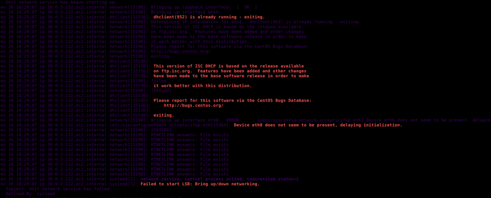

## **Erros de network do kdump.service network.service**

 
#### kdump.service network.service

 
 
 Para dar um breve resumo, com bases em teste em servidores ativos na aws, quando eu gereva os Deplouys, backups, ativação ou update dos servidores EC2 ou outros como lightsail, certa aplicação que iria fazer em uma maquina EC2 usando o comando systemctl --faile pegando status de todo o sistema.
 

 O kdump.service e network.service me retornaram falha pelo comando systemctl voltando um erro de rede incomun dentro do SO do linux, para ir mais a fundo sobre o ocorrido que não é um bug normal por conta que este serviço se refene para uso em rede, e sendo uma maquina na aws EC2 este serviço não estava devidamente em perfeito funcionamento por que se trata de uma maquina em Cloud, segui iniciando o trabolshuting e vi que o network e o dhcp ja estava funcionando, a interface eth0 estava configurada, embora a maquina não possui este dispositivo.

 #### Segue a baixo os logs e falha

## Updates recorrentes viram...

